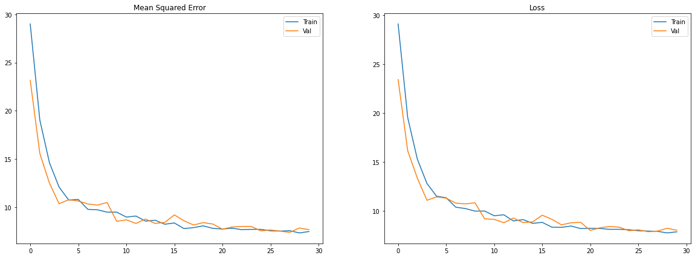

# Patient Selection for Diabetes Drug Testing

This project is part of the **Udacity AI for Healthcare** nanodegree program.

The **Project Overview** below is taken from the starter project description delivered by Udacity. The essential parts of the project are divided into two separate notebooks as described in the **Project Steps** section.

## Project Overview - Diabetes Drug Testing
**Context**: You are a data scientist for an exciting unicorn healthcare startup that has created a groundbreaking diabetes drug that is ready for Phase III clinical trial testing. It is a very unique and sensitive drug that requires administering and screening the drug over at least 5-7 days of time in the hospital with frequent monitoring/testing and patient medication adherence training with a mobile application. You have been provided a patient dataset from a client partner and are tasked with building a predictive model that can identify which type of patients the company should focus their efforts testing this drug on. Target patients are people that are likely to be in the hospital for this duration of time and will not incur significant additional costs for administering this drug to the patient and monitoring.  

In order to achieve your goal you must build a regression model that can predict the estimated hospitalization time for a patient and use this to select/filter patients for your study.

**Expected Hospitalization Time Regression Model:** Utilizing a synthetic dataset(denormalized at the line level augmentation) built off of the UCI Diabetes readmission dataset, students will build a regression model that predicts the expected days of hospitalization time and then convert this to a binary prediction of whether to include or exclude that patient from the clinical trial.

This project will demonstrate the importance of building the right data representation at the encounter level, with appropriate filtering and preprocessing/feature engineering of key medical code sets. This project will also require students to analyze and interpret their model for biases across key demographic groups. 

### Dataset
Due to healthcare PHI regulations (HIPAA, HITECH), there are limited number of publicly available datasets and some datasets require training and approval. So, for the purpose of this exercise, we are using a dataset from UC Irvine that has been modified for this course. Please note that it is limited in its representation of some key features such as diagnosis codes which are usually an unordered list in 835s/837s (the HL7 standard interchange formats used for claims and remits).

- https://archive.ics.uci.edu/ml/datasets/Diabetes+130-US+hospitals+for+years+1999-2008

## Project Steps

### 1. [Data Analysis and Preparation](1-Data-Preparation.ipynb)

Analyzing the dataset:
* null and missing values,
* numerical features distribution,
* cardinality,
* demographics.

Preparing the dataset:
* dimensionality reduction,
* dataset aggregation,
* feature selection,
* casting and imputing,
* train, val, test split.

Example columns from the dataset:

| patient_nbr | time_in_hospital* | gender |   age    | readmitted |       race      | num_medications | ... |
|-------------|-------------------|--------|----------|------------|-----------------|-----------------|-----|
| 48330783    | 13.0              | Female | \[80-90) | NO         | Caucasian       | 28.0            | ... |
| 42519267    | 1.0               | Male   | \[40-50) | NO         | Caucasian       | 8.0             | ... |
| 89869032    | 9.0               | Female | \[40-50) | >30        | AfricanAmerican | 17.0            | ... |

\* - predictor field

### 2. [Model Training and Evaluation](2-Train-And-Evaluate-Model.ipynb)

Training the model:
* dataset conversion to TF Dataset,
* categorical and numerical features creation with TF Feature Column,
* model build and training.

Evaluating the model:
* model uncertainty range with TF Probability,
* evaluation metrics,
* model bias evaluation with Aequitas.

## License

This project is licensed under the MIT License - see the [LICENSE](LICENSE).
